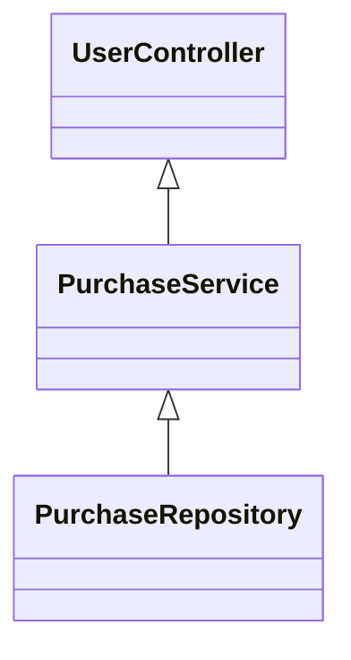
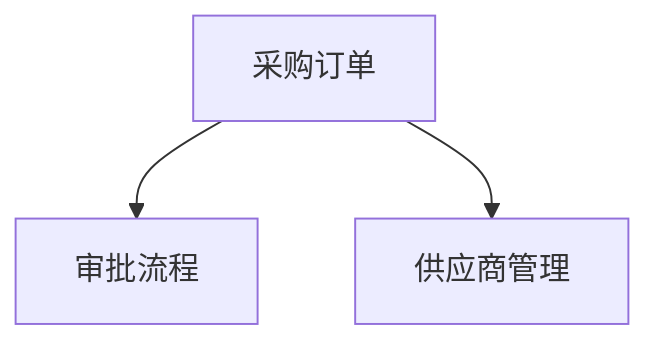

   - 本项目的目的、核心目标和对象未能直接从 README 或其他文档获取，但根据目录结构和文件命名推测，项目属于企业级采购系统，服务于海外采购业务。
   - 目标受众可能为企业采购部门、开发和运维团队。
   - 技术领域为企业资源计划（ERP）系统中的采购模块，涉及采购流程自动化、供应链管理等场景。
   - 由于缺乏详细文档，具体的业务背景和技术上下文需结合实际代码进一步分析。

   - 高层架构未能直接获取，但通过 Gradle、Maven 配置文件可知项目采用 Java 技术栈，支持多模块管理。
   - 组件划分、职责分配和系统边界需结合源码进一步分析。
   - 设计模式和架构原则未在配置文件中体现。
   - 数据流和系统关系图如下（示例）：
   

   - 主要入口点和核心模块未能直接获取，推测为 Spring Boot 或类似框架的标准入口。
   - 配置管理采用 Gradle/Maven，支持多环境属性配置。
   - 依赖管理通过 build.gradle、pom.xml 实现。
   - 组件关系图如下（示例）：
   

   - 具体实现细节需结合源码进一步分析。

   - 关键特性未能直接获取，推测包括采购订单管理、供应商管理、审批流等。
   - 具体实现和代码示例需结合源码进一步分析。
   - 示例特性架构图：
   

   - 核心流程和机制未能直接获取，推测包括采购申请、审批、下单、收货等业务流。
   - 流程图示例：
   

   - 数据转换和状态管理方式需结合源码进一步分析。

   - 项目采用主流 Java 企业开发技术，支持多模块和依赖管理，具备良好的扩展性。
   - 当前缺乏详细文档和源码，建议补充 README、架构说明和模块注释。
   - 推荐完善核心业务流程和接口文档，提升可维护性和可扩展性。
   - 下一步建议深入源码，梳理核心业务逻辑和模块关系，完善自动化测试和持续集成配置。

