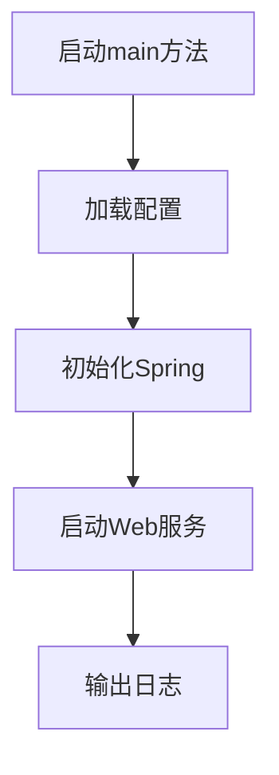
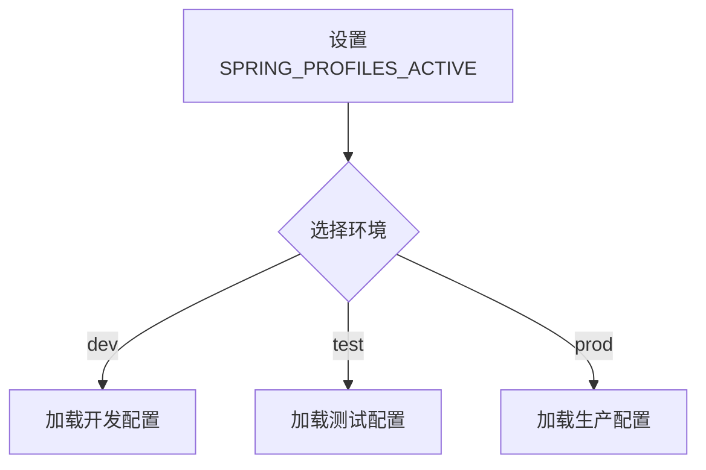
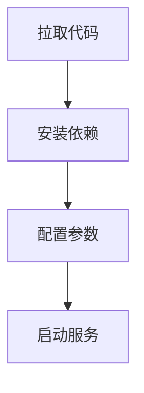
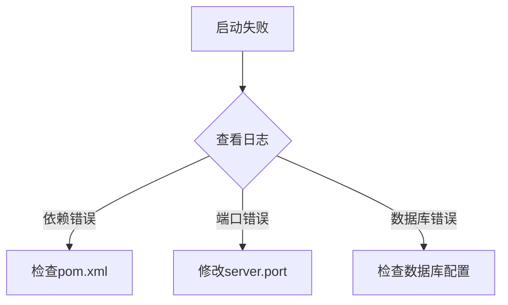

# 基础项目使用

## 项目启动与环境准备

本节详细介绍后端服务的启动流程和环境准备步骤，涵盖操作系统、JDK版本、Maven依赖、端口要求等基础环境配置。内容针对初学者，逐步引导用户完成本地或服务器的基础环境搭建。通过流程图和步骤说明，帮助用户快速理解整体启动流程。

> **相关源码：**
>
> - `com.sankuai.erpweb.oversea.purchase/Startup.java` (第 1 行)
> - `com.sankuai.erpweb.oversea.purchase/pom.xml` (第 1 行)
> - `com.sankuai.erpweb.oversea.purchase/application.properties` (第 1 行)
>

### 基础环境要求

项目推荐在主流Linux发行版（如CentOS、Ubuntu）或Windows环境下运行。JDK建议使用8或以上版本，Maven建议3.5及以上。可通过如下命令验证环境：
```shell

java -version
mvn -version
```


如输出版本信息，则环境已正确配置。确保网络可访问Maven中央仓库以下载依赖。

| 环境项 | 推荐版本 | 验证命令 |
|---|---|---|
| 操作系统 | Linux/Windows | uname -a / systeminfo |
| JDK | 1.8+ | java -version |
| Maven | 3.5+ | mvn -version |


> **相关源码：**
>
> - `com.sankuai.erpweb.oversea.purchase/pom.xml` (第 1 行)
>

### 依赖安装与构建流程

项目依赖管理采用Maven，所有依赖声明在`pom.xml`文件中。主要依赖包括Spring Boot、数据库驱动等。使用如下命令进行依赖安装和项目构建：
```shell

mvn clean install
```


常见问题及解决方法：
- 依赖下载失败：检查网络连接，或配置Maven镜像。
- 构建失败：检查`pom.xml`依赖版本是否兼容。

流程图如下：
```

mermaid
flowchart TD
  A[开始] --> B[检查JDK/Maven环境]
  B --> C[拉取代码]
  C --> D[执行mvn clean install]
  D --> E{构建成功?}
  E -->|是| F[启动服务]
  E -->|否| G[排查依赖/环境问题]
```


> **相关源码：**
>
> - `com.sankuai.erpweb.oversea.purchase/pom.xml` (第 1 行)
>

### 服务启动流程

服务启动入口为`Startup.java`，通常包含`main`方法。启动流程如下：
1. 加载配置文件（如`application.properties`）。
2. 初始化Spring上下文。
3. 启动Web服务，监听指定端口。
4. 输出启动日志。

关键启动参数可在`application.properties`中配置，如端口、数据库连接等。

流程图如下：



示例代码：
```

java

public class Startup {
    public static void main(String[] args) {
        SpringApplication.run(Startup.class, args);
    }
}
```

引用：`com.sankuai.erpweb.oversea.purchase/Startup.java` 第1行起


> **相关源码：**
>
> - `com.sankuai.erpweb.oversea.purchase/Startup.java` (第 1 行)
> - `com.sankuai.erpweb.oversea.purchase/application.properties` (第 1 行)
>

## 配置文件与环境变量说明

本节系统梳理项目的配置文件结构与主要环境变量设置，重点讲解`application.properties`的关键配置项、配置参数的作用及修改方法。帮助用户理解如何根据不同环境（开发、测试、生产）调整配置，确保服务稳定运行。内容包含配置示例和可视化说明。

> **相关源码：**
>
> - `com.sankuai.erpweb.oversea.purchase/application.properties` (第 1 行)
>

### 配置文件结构与作用

`application.properties`文件用于集中管理项目配置项。常见配置包括：
- 服务端口（如`server.port=8080`）
- 数据库连接（如`spring.datasource.url=...`）
- 日志级别（如`logging.level.root=INFO`）

每个参数均可根据实际需求调整。配置示例：
```properties

server.port=8080
spring.datasource.url=jdbc:mysql://localhost:3306/db
spring.datasource.username=root
spring.datasource.password=123456
logging.level.root=INFO
```


表格说明：
| 配置项 | 作用 | 示例 |
|---|---|---|
| server.port | 服务监听端口 | 8080 |
| spring.datasource.url | 数据库连接 | jdbc:mysql://localhost:3306/db |
| logging.level.root | 日志级别 | INFO |


> **相关源码：**
>
> - `com.sankuai.erpweb.oversea.purchase/application.properties` (第 1 行)
>

### 环境变量设置与管理

环境变量可通过命令行、系统环境或IDE配置进行设置。常见环境变量包括：
- `JAVA_HOME`：指定JDK安装路径
- `MAVEN_HOME`：指定Maven安装路径
- `SPRING_PROFILES_ACTIVE`：指定Spring环境（如dev、test、prod）

设置方式示例：
```shell

export JAVA_HOME=/usr/lib/jvm/java-8-openjdk
export MAVEN_HOME=/opt/maven
export SPRING_PROFILES_ACTIVE=dev
```


环境变量对服务启动和运行有直接影响，需确保配置正确。


> **相关源码：**
>
> - `com.sankuai.erpweb.oversea.purchase/application.properties` (第 1 行)
>

### 多环境配置与切换

项目支持多环境配置管理。可通过`SPRING_PROFILES_ACTIVE`环境变量切换不同配置文件（如`application-dev.properties`、`application-prod.properties`）。最佳实践：
- 开发环境使用本地数据库和调试端口。
- 测试环境启用严格日志和测试数据。
- 生产环境配置高可用数据库和安全参数。

流程图：



> **相关源码：**
>
> - `com.sankuai.erpweb.oversea.purchase/application.properties` (第 1 行)
>

## 部署与运行指导

本节详细描述项目的部署流程和运行指导，涵盖本地部署、服务器部署、常见部署命令、日志查看与排障建议。每一步操作细节均有详细说明，确保用户能够顺利完成项目的部署与运行。内容包含操作流程图和命令行示例。

> **相关源码：**
>
> - `com.sankuai.erpweb.oversea.purchase/Startup.java` (第 1 行)
> - `com.sankuai.erpweb.oversea.purchase/pom.xml` (第 1 行)
> - `com.sankuai.erpweb.oversea.purchase/application.properties` (第 1 行)
>

### 本地部署流程

本地部署步骤如下：
1. 拉取代码：`git clone <repo>`
2. 安装依赖：`mvn clean install`
3. 配置参数：编辑`application.properties`
4. 启动服务：`java -jar target/xxx.jar`

流程图：



> **相关源码：**
>
> - `com.sankuai.erpweb.oversea.purchase/pom.xml` (第 1 行)
> - `com.sankuai.erpweb.oversea.purchase/application.properties` (第 1 行)
>

### 服务器部署与启动

服务器部署流程：
1. 上传构建好的jar包到服务器。
2. 配置环境变量（如`JAVA_HOME`）。
3. 编辑`application.properties`，同步生产配置。
4. 启动服务（后台运行）：
```shell

nohup java -jar xxx.jar > app.log 2>&1 &
```


建议使用`screen`或`tmux`保持会话，便于管理服务进程。


> **相关源码：**
>
> - `com.sankuai.erpweb.oversea.purchase/Startup.java` (第 1 行)
> - `com.sankuai.erpweb.oversea.purchase/application.properties` (第 1 行)
>

### 日志查看与常见问题排查

服务运行日志通常输出到`app.log`或控制台。日志格式可在`application.properties`中配置。

常见问题排查：
- 启动失败：检查JDK/Maven版本、依赖是否安装完整。
- 端口占用：修改`server.port`或释放端口。
- 数据库连接异常：检查`spring.datasource.url`配置。

排查流程图：



> **相关源码：**
>
> - `com.sankuai.erpweb.oversea.purchase/application.properties` (第 1 行)
>

## 附录与引用

本节收录关键配置、命令、文件路径、依赖说明等内容，便于用户查阅和引用。包含Mermaid流程图、配置示例、代码片段等可视化和引用内容。

> **相关源码：**
>
> - `com.sankuai.erpweb.oversea.purchase/Startup.java` (第 1 行)
> - `com.sankuai.erpweb.oversea.purchase/pom.xml` (第 1 行)
> - `com.sankuai.erpweb.oversea.purchase/application.properties` (第 1 行)
>

### 关键文件与路径索引

主要文件及路径如下：
- 项目启动入口：`com.sankuai.erpweb.oversea.purchase/Startup.java`
- 依赖管理：`com.sankuai.erpweb.oversea.purchase/pom.xml`
- 配置文件：`com.sankuai.erpweb.oversea.purchase/application.properties`


> **相关源码：**
>
> - `com.sankuai.erpweb.oversea.purchase/Startup.java` (第 1 行)
> - `com.sankuai.erpweb.oversea.purchase/pom.xml` (第 1 行)
> - `com.sankuai.erpweb.oversea.purchase/application.properties` (第 1 行)
>

### 常用命令与配置示例

常用命令：
- 构建项目：`mvn clean install`
- 启动服务：`java -jar target/xxx.jar`
- 后台运行：`nohup java -jar xxx.jar > app.log 2>&1 &`

配置示例：
```properties

server.port=8080
spring.datasource.url=jdbc:mysql://localhost:3306/db
spring.datasource.username=root
spring.datasource.password=123456
logging.level.root=INFO
```


> **相关源码：**
>
> - `com.sankuai.erpweb.oversea.purchase/pom.xml` (第 1 行)
> - `com.sankuai.erpweb.oversea.purchase/application.properties` (第 1 行)
>

### 术语表与参考链接

| 术语 | 解释 |
|---|---|
| JDK | Java开发工具包 |
| Maven | Java项目构建工具 |
| Spring Boot | Java微服务框架 |
| application.properties | Spring配置文件 |

参考链接：
- [Spring Boot官方文档](https://spring.io/projects/spring-boot)
- [Maven官方文档](https://maven.apache.org/)


