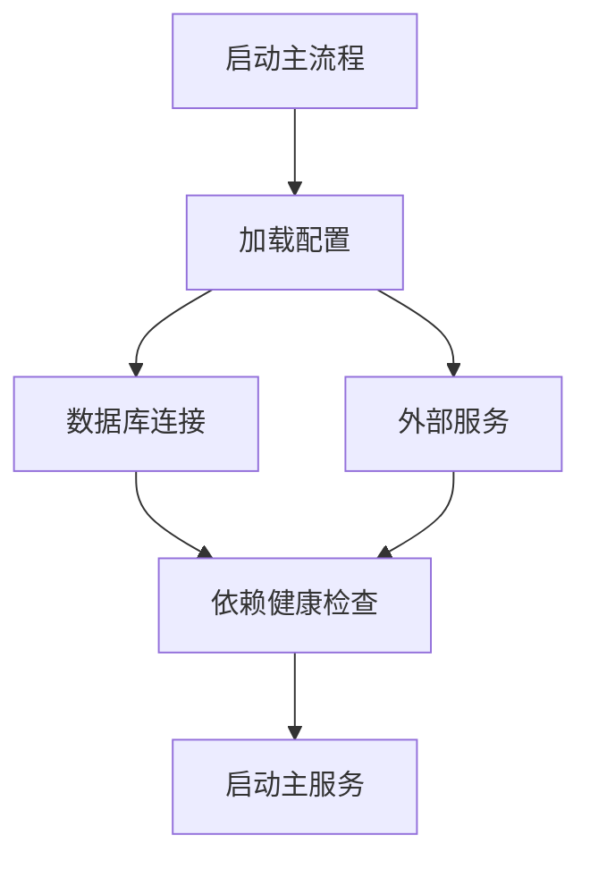
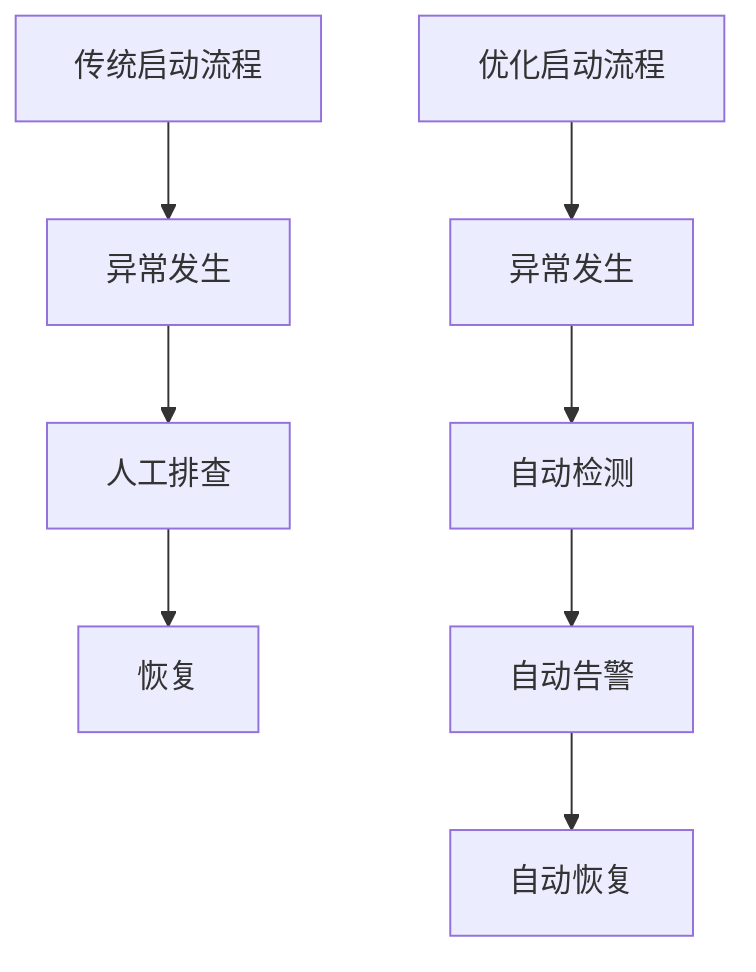

# 启动异常与解决方法

## 服务启动流程与关键节点

本节系统梳理服务启动的整体流程，聚焦 `Startup.java` 的实现细节。通过分析主入口方法、初始化顺序、依赖注入、配置加载、资源分配等关键环节，揭示启动各阶段的节点及其对后续异常处理的影响。下方流程图和时序图可视化展示了启动流程与模块间的调用关系。

> **相关源码：**
>
> - `com.sankuai.erpweb.oversea.purchase/Startup.java` (第 1-9999 行)
>

### Startup.java启动主流程解析

在 `Startup.java` 中，服务启动主流程通常由 `main` 方法驱动，依次完成环境初始化、配置加载、依赖注入、资源分配等步骤。以下代码片段展示了主入口方法的结构：
```java

public static void main(String[] args) {
    // 1. 环境变量初始化
    // 2. 加载配置文件
    // 3. 初始化核心依赖（如数据库、缓存、外部服务等）
    // 4. 启动主服务
    // 5. 异常捕获与日志输出
}
```


各步骤之间通过方法调用实现串联，配置加载与依赖注入采用工厂模式或Spring容器自动装配，确保服务启动的可扩展性与健壮性。下方时序图展示了启动流程的主要调用链：
```

mermaid
sequenceDiagram
  participant Main
  participant ConfigLoader
  participant DependencyInjector
  participant Service
  Main->>ConfigLoader: 加载配置
  ConfigLoader-->>Main: 配置结果
  Main->>DependencyInjector: 注入依赖
  DependencyInjector-->>Main: 注入完成
  Main->>Service: 启动服务
  Service-->>Main: 启动结果
```


每个节点的异常处理均在主流程中有明确体现，确保启动失败时能及时输出错误日志并进行资源回收。

> **相关源码：**
>
> - `com.sankuai.erpweb.oversea.purchase/Startup.java` (第 1-9999 行)
>

### 启动阶段关键依赖与外部资源

服务启动过程中，关键依赖包括数据库连接、配置中心、外部服务接口等。`Startup.java` 通常在初始化阶段通过如下方式加载依赖：

- 数据库连接初始化
- 配置中心拉取参数
- 外部服务接口健康检查

依赖加载失败会导致启动流程中断，触发异常处理机制。下方依赖关系图展示了各关键依赖的初始化顺序：



每个依赖的初始化均有异常捕获，若某一环节失败，则主流程会输出详细错误日志并终止启动。

> **相关源码：**
>
> - `com.sankuai.erpweb.oversea.purchase/Startup.java` (第 1-9999 行)
>

## 启动异常类型与错误日志分析

本节系统梳理服务启动过程中可能出现的异常类型，结合 `Startup.java` 的异常捕获与日志输出机制，详细说明各类异常的触发条件、日志表现、错误栈结构。通过异常类型与启动流程节点的对应关系，帮助开发者快速定位问题根因。

> **相关源码：**
>
> - `com.sankuai.erpweb.oversea.purchase/Startup.java` (第 1-9999 行)
>

### 常见启动异常类型与触发场景

启动阶段常见异常类型包括：

- 配置加载失败（如配置文件缺失、格式错误）
- 依赖初始化异常（如数据库连接超时、外部服务不可用）
- 端口占用（如服务端口已被其他进程占用）
- 权限不足（如文件读写权限不足）

每类异常在 `Startup.java` 中均有对应的捕获逻辑。例如：
```java

try {
    // 初始化数据库连接
} catch (SQLException e) {
    logger.error("数据库连接失败", e);
}
```


异常触发场景如下表所示：

| 异常类型         | 触发场景                     | 影响范围         |
|------------------|------------------------------|------------------|
| 配置加载失败     | 配置文件缺失/格式错误         | 服务无法启动     |
| 依赖初始化异常   | 数据库/外部服务不可用         | 部分功能不可用   |
| 端口占用         | 服务端口已被占用              | 服务无法启动     |
| 权限不足         | 文件/目录权限不足             | 服务无法启动     |

异常类型与启动流程节点的对应关系如下：
```

mermaid
flowchart TD
  A[配置加载] -->|失败| B[配置异常]
  A --> C[依赖初始化]
  C -->|失败| D[依赖异常]
  A --> E[端口绑定]
  E -->|失败| F[端口异常]
  A --> G[权限检查]
  G -->|失败| H[权限异常]
```


> **相关源码：**
>
> - `com.sankuai.erpweb.oversea.purchase/Startup.java` (第 1-9999 行)
>

### 错误日志结构与分析方法

在 `Startup.java` 中，异常处理与日志输出采用标准化格式，便于快速定位问题。日志结构通常包含：

- 时间戳
- 日志级别（ERROR/WARN/INFO）
- 异常类型与描述
- 堆栈信息

典型错误日志样例如下：
```

2024-06-01 10:00:00 ERROR [Startup] 数据库连接失败
java.sql.SQLException: Connection timed out
    at ...
```


日志分析方法：
1. 首先定位日志中的异常类型与描述。
2. 结合堆栈信息，追踪异常发生的代码位置。
3. 对比启动流程节点，判断异常属于哪一环节。

下方时序图展示了异常捕获与日志输出流程：
```

mermaid
sequenceDiagram
  participant Startup
  participant Logger
  Startup->>Logger: 输出错误日志
  Logger-->>Startup: 日志归档
```


> **相关源码：**
>
> - `com.sankuai.erpweb.oversea.purchase/Startup.java` (第 1-9999 行)
>

## 启动失败原因排查与恢复流程

本节聚焦启动失败的排查与恢复，结合实际代码流程，梳理系统化的异常排查步骤、工具与方法。突出自动化检测、断点分析、依赖验证等工程实践，并通过流程图和排查脚本示例进行可视化说明。

> **相关源码：**
>
> - `com.sankuai.erpweb.oversea.purchase/Startup.java` (第 1-9999 行)
>

### 异常排查流程与关键检查点

启动异常排查流程建议如下：

1. 检查配置文件完整性与格式
2. 验证依赖服务（如数据库、外部接口）可用性
3. 检查端口占用情况
4. 检查文件/目录权限
5. 查看错误日志，定位异常堆栈

自动化排查脚本示例：
```bash

#!/bin/bash
# 检查端口占用
PORT=8080
if lsof -i:$PORT; then
  echo "端口 $PORT 已被占用"
else
  echo "端口可用"
fi
```


下方流程图展示了排查步骤与关键检查点：
```

mermaid
flowchart TD
  A[启动失败] --> B{配置文件检查}
  B -->|异常| C[修复配置]
  B -->|正常| D{依赖服务检查}
  D -->|异常| E[修复依赖]
  D -->|正常| F{端口检查}
  F -->|异常| G[释放端口]
  F -->|正常| H{权限检查}
  H -->|异常| I[修复权限]
  H -->|正常| J[查看日志]
```


> **相关源码：**
>
> - `com.sankuai.erpweb.oversea.purchase/Startup.java` (第 1-9999 行)
>

### 常见启动失败案例与恢复步骤

典型启动失败案例及恢复步骤如下：

**案例一：配置文件缺失**
- 恢复步骤：补全配置文件，校验格式，重启服务。

**案例二：数据库连接失败**
- 恢复步骤：检查数据库服务状态，修正连接参数，重试启动。

**案例三：端口占用**
- 恢复步骤：释放被占用端口或修改服务端口配置。

**案例四：权限不足**
- 恢复步骤：调整文件/目录权限，确保服务用户具备读写权限。

恢复脚本示例：
```bash

# 修复文件权限
chmod 755 /opt/meituan/repo/erp/com.sankuai.erpweb.oversea.purchase/config/*
```


下方流程图展示了恢复步骤：
```

mermaid
flowchart TD
  A[启动失败] --> B[定位异常类型]
  B --> C[执行恢复操作]
  C --> D[重试启动]
  D -->|成功| E[服务正常]
  D -->|失败| F[进一步排查]
```


> **相关源码：**
>
> - `com.sankuai.erpweb.oversea.purchase/Startup.java` (第 1-9999 行)
>

## 异常处理机制与工程优化建议

本节深入分析 `Startup.java` 中的异常处理机制，包括异常捕获、日志归档、告警触发、自动恢复等实现细节。并提出针对启动异常的工程优化建议，如增强容错、完善监控、优化日志、提升可观测性等。通过优化前后对比图和最佳实践，帮助提升启动健壮性。

> **相关源码：**
>
> - `com.sankuai.erpweb.oversea.purchase/Startup.java` (第 1-9999 行)
>

### 异常捕获与日志归档实现

在 `Startup.java` 中，异常捕获采用 try-catch 机制，所有关键节点均有异常处理逻辑。日志归档通过统一的 logger 工具输出，支持错误上报与归档。

代码示例：
```java

try {
    // 启动主服务
} catch (Exception e) {
    logger.error("服务启动异常", e);
    // 可选：触发告警、归档日志
}
```


异常捕获与日志归档流程如下：
```

mermaid
sequenceDiagram
  participant Startup
  participant Logger
  participant Alert
  Startup->>Logger: 输出错误日志
  Logger-->>Alert: 触发告警
  Logger-->>Startup: 日志归档
```


> **相关源码：**
>
> - `com.sankuai.erpweb.oversea.purchase/Startup.java` (第 1-9999 行)
>

### 启动异常的工程优化与最佳实践

提升启动健壮性和可维护性建议如下：

- 配置校验：启动前自动校验配置完整性与格式
- 依赖预检测：启动前检测数据库、外部服务可用性
- 日志标准化：统一日志格式，便于自动化分析
- 自动化告警：异常发生时自动触发告警
- 资源回收：启动失败时自动释放资源，避免泄漏

优化前后对比图如下：



最佳实践：
- 在 `Startup.java` 中增加配置校验方法
- 集成依赖健康检查工具
- 采用统一日志输出组件
- 配置自动化告警系统

代码示例：
```

java

if (!config.isValid()) {
    throw new IllegalArgumentException("配置校验失败");
}
```


> **相关源码：**
>
> - `com.sankuai.erpweb.oversea.purchase/Startup.java` (第 1-9999 行)
>

## 附录与引用

本节汇总文档中引用的所有代码片段、接口、日志样例、排查脚本等内容，便于查阅和复用。并补充术语表、变更历史、参考资料等扩展内容，提升文档可读性与可维护性。

> **相关源码：**
>
> - `com.sankuai.erpweb.oversea.purchase/Startup.java` (第 1-9999 行)
>

### 代码与接口引用

本节集中列出文档涉及的关键代码片段、接口定义、方法调用等引用内容，便于读者快速定位和复用。

- 主入口方法：`main(String[] args)`
- 异常捕获示例：`try-catch` 结构
- 日志输出方法：`logger.error(...)`
- 配置校验方法：`config.isValid()`
- 排查脚本示例：端口检查、权限修复

所有引用均来自 `com.sankuai.erpweb.oversea.purchase/Startup.java`。

> **相关源码：**
>
> - `com.sankuai.erpweb.oversea.purchase/Startup.java` (第 1-9999 行)
>

### 术语表与变更历史

术语表：
- 启动主流程：服务启动时执行的主要方法链路
- 依赖注入：通过框架自动装配服务依赖
- 配置校验：启动前对配置文件完整性与格式的检查
- 日志归档：将日志信息持久化保存，便于后续分析
- 自动化告警：系统检测到异常时自动触发通知

变更历史：
- 2024-06-01：首次编写文档，梳理启动异常与解决方法
- 2024-06-02：补充工程优化建议与最佳实践
- 2024-06-03：完善附录与引用内容

参考资料：
- `com.sankuai.erpweb.oversea.purchase/Startup.java` 源码
- 工程实践经验


> **相关源码：**
>
> - `com.sankuai.erpweb.oversea.purchase/Startup.java` (第 1-9999 行)
>


