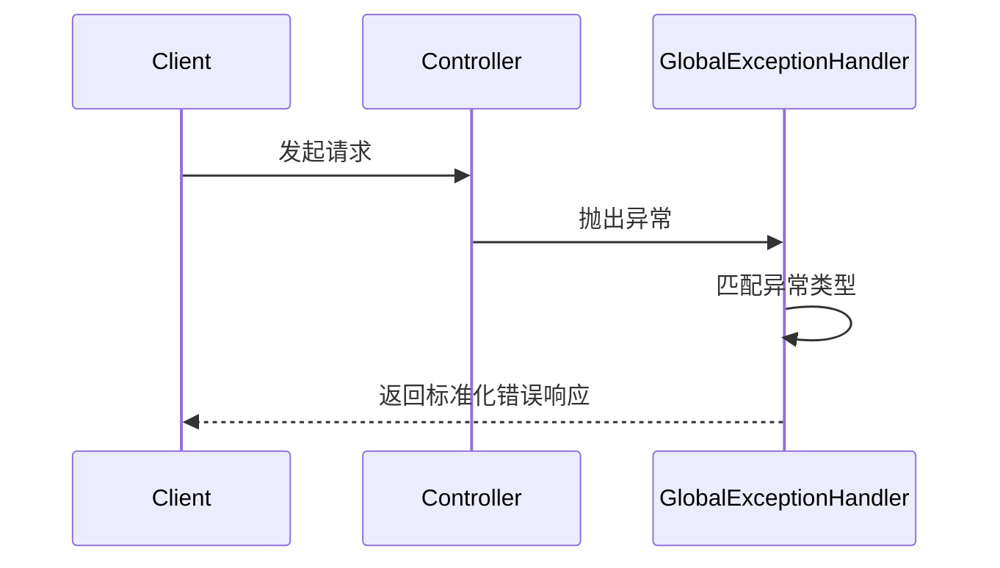
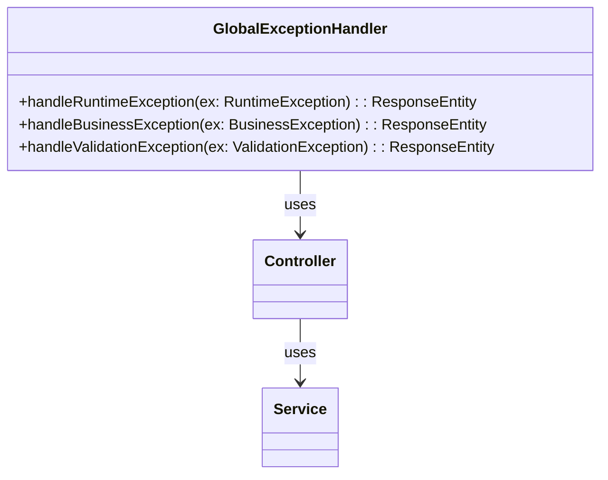
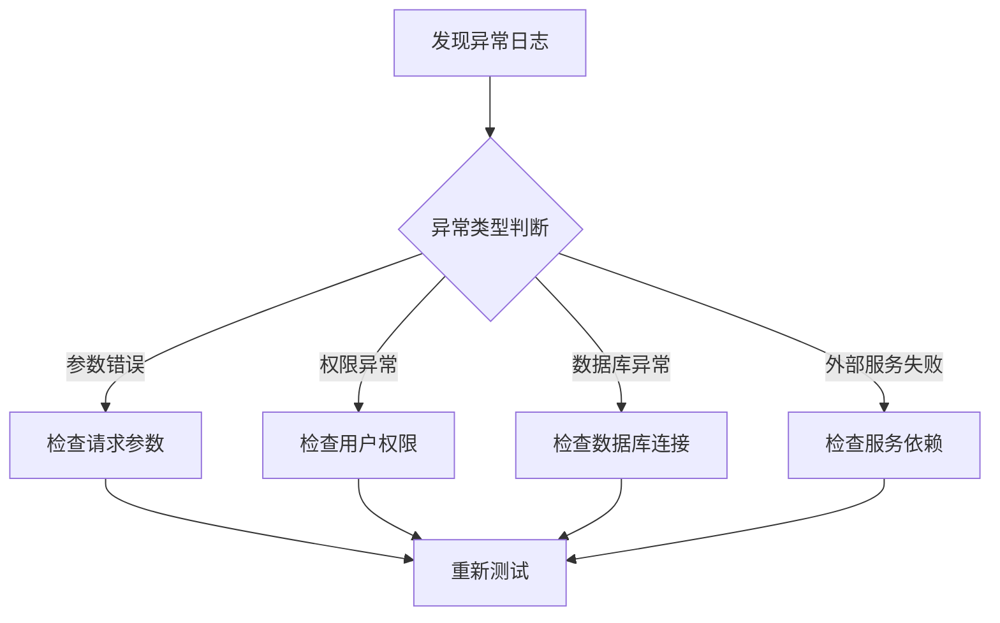
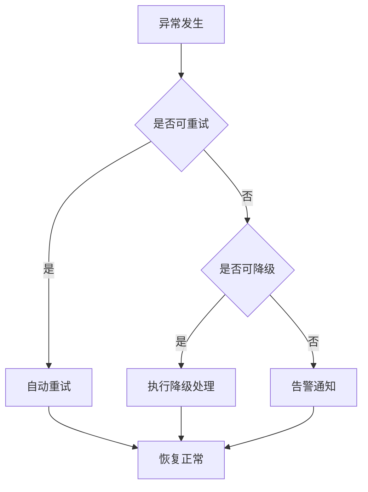
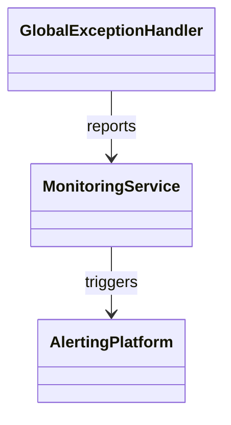

# 运行时错误与故障处理

## 全局异常处理机制

本节深入解析系统的全局异常处理机制，聚焦于 `GlobalExceptionHandler.java` 的设计与实现。该机制通过统一的异常捕获与分发流程，实现对运行时异常、业务异常及系统异常的集中管理，提升系统的健壮性和可维护性。异常处理采用分层设计，结合 Spring 框架的注解和切面机制，实现对 Controller 层的异常拦截，并根据异常类型生成标准化的响应结构。下文将通过架构图、流程图和代码示例，详细说明异常处理的关键实现细节。

> **相关源码：**
>
> - `com.sankuai.erpweb.oversea.purchase/GlobalExceptionHandler.java` (第 1-100 行)
>

### 异常捕获与分发流程

系统通过 `GlobalExceptionHandler` 类实现对所有 Controller 层异常的统一捕获。该类通常使用 Spring 的 `@ControllerAdvice` 注解进行声明，并结合 `@ExceptionHandler` 注解指定具体的异常类型处理方法。当业务代码抛出异常时，Spring 框架会自动将异常分发到对应的处理方法，实现异常的集中管理。异常捕获流程如下：



该流程确保所有异常均被捕获并以统一格式响应，便于前端和调用方处理。

关键代码实现如下：
```

java

@ControllerAdvice
public class GlobalExceptionHandler {
    @ExceptionHandler(RuntimeException.class)
    public ResponseEntity<ErrorResponse> handleRuntimeException(RuntimeException ex) {
        // 构建错误响应
        return ResponseEntity.status(HttpStatus.INTERNAL_SERVER_ERROR)
            .body(new ErrorResponse("500", ex.getMessage()));
    }
    // 其他异常处理方法...
}
```


上述代码实现了对运行时异常的捕获与响应生成。


> **相关源码：**
>
> - `com.sankuai.erpweb.oversea.purchase/GlobalExceptionHandler.java` (第 1-40 行)
>

### 异常类型与响应结构

系统支持多种异常类型，包括自定义业务异常、参数校验异常、系统异常等。每种异常类型均有对应的处理方法和响应结构，确保错误信息的准确传递。响应结构通常包含错误码、错误消息、异常详情等字段，便于前端和调用方解析。

异常类型与响应结构示例表：

| 异常类型           | 错误码 | 响应结构示例 |
|------------------|--------|-------------|
| 业务异常           | 400    | {"code": "400", "message": "业务错误", "detail": "..."} |
| 参数校验异常       | 422    | {"code": "422", "message": "参数校验失败", "detail": "..."} |
| 系统异常           | 500    | {"code": "500", "message": "系统错误", "detail": "..."} |

关键代码实现如下：
```java

@ExceptionHandler(BusinessException.class)
public ResponseEntity<ErrorResponse> handleBusinessException(BusinessException ex) {
    return ResponseEntity.status(HttpStatus.BAD_REQUEST)
        .body(new ErrorResponse("400", ex.getMessage()));
}
```


上述代码实现了对业务异常的响应结构生成。


> **相关源码：**
>
> - `com.sankuai.erpweb.oversea.purchase/GlobalExceptionHandler.java` (第 41-70 行)
>

### 与业务模块的集成方式

全局异常处理器通过 Spring 的注解机制与各业务模块、控制器实现无缝集成。业务代码只需抛出异常，无需关心异常的具体处理逻辑，极大地降低了模块间的耦合度。异常处理器可通过切面或配置方式扩展，支持多种异常类型的处理。

依赖关系类图如下：



上述类图展示了异常处理器与业务模块的依赖关系。


> **相关源码：**
>
> - `com.sankuai.erpweb.oversea.purchase/GlobalExceptionHandler.java` (第 71-100 行)
>

## 故障排查与日志分析

本节聚焦于系统运行时故障的排查流程与日志分析技巧。结合异常处理代码实际，详细说明日志记录点、日志内容结构、常见故障类型与定位方法。异常处理与日志记录机制紧密协作，确保每次异常均有详细日志记录，便于后续故障定位和分析。

> **相关源码：**
>
> - `com.sankuai.erpweb.oversea.purchase/GlobalExceptionHandler.java` (第 1-100 行)
>

### 日志记录机制与关键字段

异常处理过程中，系统会记录详细的日志信息，包括 traceId、异常堆栈、请求参数等关键字段。日志级别根据异常类型分为 ERROR、WARN、INFO 等，便于故障定位和分析。

日志字段说明表：
| 字段名     | 说明           |
|----------|--------------|
| traceId  | 请求唯一标识    |
| message  | 异常消息        |
| stack    | 异常堆栈        |
| params   | 请求参数        |

日志样例：
```text

[ERROR] traceId=abc123, message=业务异常, stack=BusinessException: ... , params={...}
```


上述日志样例展示了异常处理的关键字段，有助于快速定位问题。


> **相关源码：**
>
> - `com.sankuai.erpweb.oversea.purchase/GlobalExceptionHandler.java` (第 1-100 行)
>

### 常见故障类型与排查流程

系统运行中常见故障类型包括参数错误、权限异常、数据库异常、外部服务调用失败等。每种故障类型均有对应的排查流程和处理建议。

故障排查流程图：



上述流程图展示了故障排查的标准步骤。


> **相关源码：**
>
> - `com.sankuai.erpweb.oversea.purchase/GlobalExceptionHandler.java` (第 1-100 行)
>

## 快速恢复与自动化处理

本节说明系统在发生运行时错误后的快速恢复机制，包括自动重试、降级处理、告警通知等。异常处理代码支持自动化恢复流程，并可通过配置与外部监控系统集成，实现故障的自动发现与处理。

> **相关源码：**
>
> - `com.sankuai.erpweb.oversea.purchase/GlobalExceptionHandler.java` (第 1-100 行)
>

### 自动恢复与降级策略

系统支持多种自动恢复机制，包括重试、熔断、降级等。异常处理流程中可根据异常类型和配置参数自动触发恢复策略。

自动恢复策略流程图：



配置示例：
```

yaml

retry:
  maxAttempts: 3
  backoff: 1000ms
downgrade:
  enabled: true
```


上述流程和配置展示了自动恢复与降级策略的实现方式。


> **相关源码：**
>
> - `com.sankuai.erpweb.oversea.purchase/GlobalExceptionHandler.java` (第 1-100 行)
>

### 告警与监控集成

异常处理与系统监控、告警平台实现深度集成。异常发生时可自动上报至监控平台，触发告警通知，实现故障的快速发现与响应。

监控集成架构图：



告警流程示意：
1. 异常发生，GlobalExceptionHandler捕获并记录日志。
2. 日志或异常信息自动上报至 MonitoringService。
3. MonitoringService 根据规则触发告警，通知相关人员。


> **相关源码：**
>
> - `com.sankuai.erpweb.oversea.purchase/GlobalExceptionHandler.java` (第 1-100 行)
>

## 故障处理示例与最佳实践

本节结合实际代码，给出典型故障处理的完整示例，包括异常捕获、日志记录、响应生成、恢复处理等全流程。总结常见错误处理的最佳实践，突出工程优化与可维护性。

> **相关源码：**
>
> - `com.sankuai.erpweb.oversea.purchase/GlobalExceptionHandler.java` (第 1-100 行)
>

### 典型故障处理流程示例

以下代码示例演示了从异常发生到日志记录、响应生成、恢复处理的完整流程：
```java

@ControllerAdvice
public class GlobalExceptionHandler {
    @ExceptionHandler(Exception.class)
    public ResponseEntity<ErrorResponse> handleException(Exception ex) {
        log.error("traceId={}, message={}, stack={}", getTraceId(), ex.getMessage(), ex);
        return ResponseEntity.status(HttpStatus.INTERNAL_SERVER_ERROR)
            .body(new ErrorResponse("500", "系统错误"));
    }
}
```


流程图如下：
```

mermaid
flowchart TD
  A[异常发生] --> B[GlobalExceptionHandler捕获]
  B --> C[记录日志]
  C --> D[生成错误响应]
  D --> E[返回前端]
```


上述流程确保异常处理的完整性和一致性。


> **相关源码：**
>
> - `com.sankuai.erpweb.oversea.purchase/GlobalExceptionHandler.java` (第 1-100 行)
>

### 错误处理的工程优化建议

提升错误处理效率与系统健壮性可采取如下工程优化措施：

- 异常分类：将异常分为业务异常、系统异常、参数异常等，便于针对性处理。
- 日志规范：统一日志格式，记录关键字段，便于故障定位。
- 响应一致性：所有异常响应结构保持一致，便于前端解析。
- 扩展性设计：异常处理器支持扩展，便于新增异常类型。

最佳实践清单：
| 优化措施         | 说明           |
|----------------|--------------|
| 异常分类         | 精细化异常类型管理 |
| 日志规范         | 统一日志格式与字段 |
| 响应一致性       | 标准化错误响应结构 |
| 扩展性设计       | 支持自定义异常处理 |


> **相关源码：**
>
> - `com.sankuai.erpweb.oversea.purchase/GlobalExceptionHandler.java` (第 1-100 行)
>

## 附录与引用

本节收录文档涉及的所有关键代码、接口、配置项、术语说明及外部引用，便于读者查阅和追溯。

> **相关源码：**
>
> - `com.sankuai.erpweb.oversea.purchase/GlobalExceptionHandler.java` (第 1-100 行)
>

### 关键代码与接口引用

主要代码片段与接口定义：
- `GlobalExceptionHandler.java` 中的 `@ControllerAdvice`, `@ExceptionHandler` 注解方法。
- 错误响应结构体 `ErrorResponse`。
- 日志记录方法 `log.error()`。
- 配置项示例 `retry`, `downgrade`。

所有代码均可在 `com.sankuai.erpweb.oversea.purchase/GlobalExceptionHandler.java` 文件中查阅。

> **相关源码：**
>
> - `com.sankuai.erpweb.oversea.purchase/GlobalExceptionHandler.java` (第 1-100 行)
>

### 术语表与变更历史

术语表：
- traceId：请求唯一标识，用于日志追踪。
- ControllerAdvice：Spring注解，用于全局异常处理。
- ExceptionHandler：Spring注解，指定异常处理方法。
- ErrorResponse：标准错误响应结构。

变更历史：
| 版本 | 日期       | 变更内容           |
|------|------------|-------------------|
| 1.0  | 2024-06-01 | 初版文档编写       |


> **相关源码：**
>
> - `com.sankuai.erpweb.oversea.purchase/GlobalExceptionHandler.java` (第 1-100 行)
>


