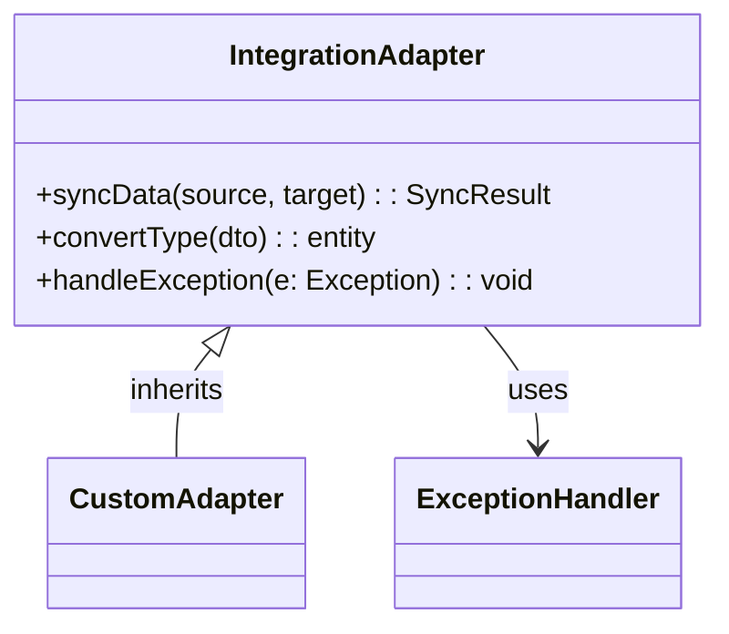
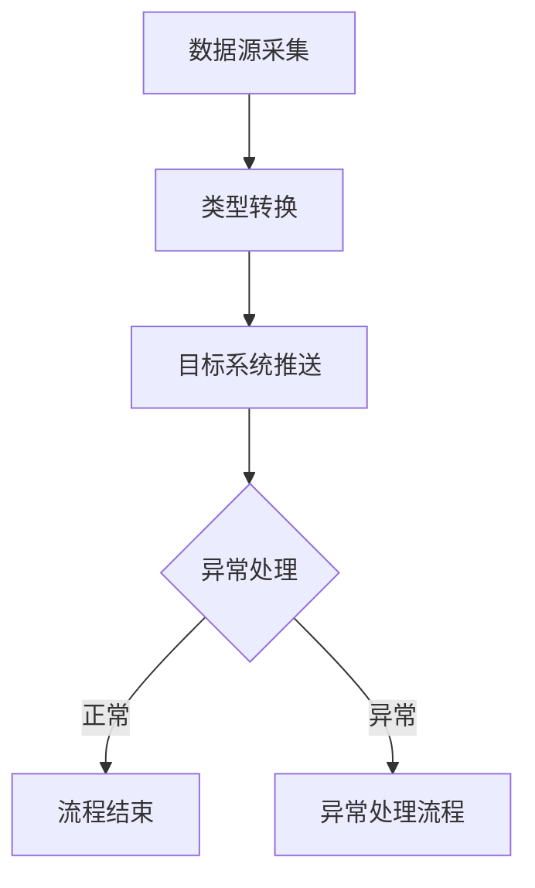
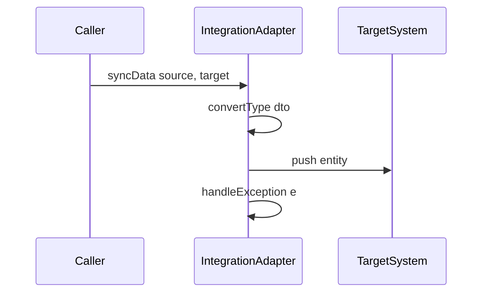
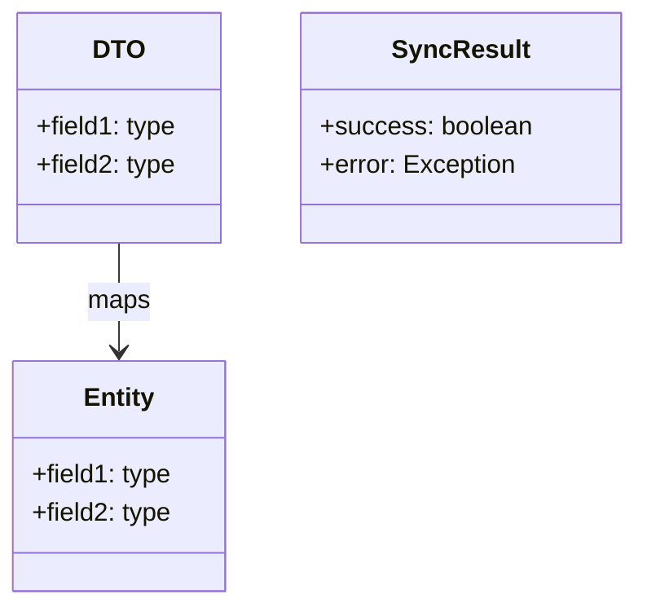
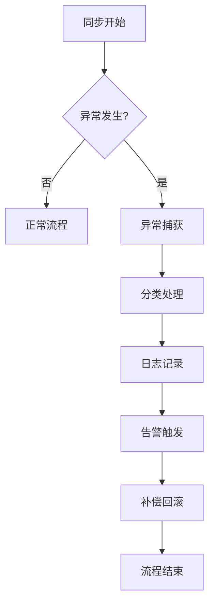
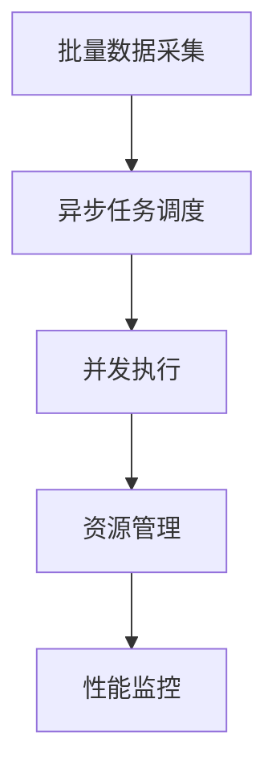
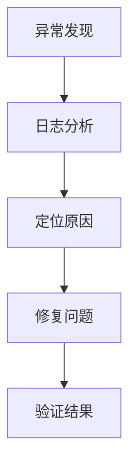
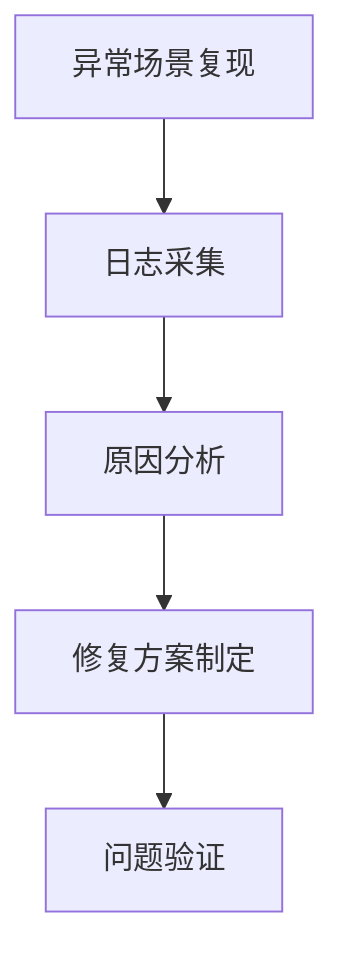

# 数据同步流程与异常处理

## 系统架构与核心组件

本节将深入解析com.sankuai.erpweb.oversea.purchase模块的数据同步系统架构。该模块采用分层设计，核心组件围绕`IntegrationAdapter`展开，负责数据同步的适配、流程控制与异常处理。整体架构强调模块间的职责分离与协作，确保同步流程的可扩展性与健壮性。下图展示了核心组件的架构关系与调用路径：
```mermaid
classDiagram
  class IntegrationAdapter
  IntegrationAdapter : +syncData[source, target]: SyncResult
  IntegrationAdapter : +handleException[e: Exception]: void
  IntegrationAdapter : +convertType[dto]: entity
  IntegrationAdapter --> SourceSystem : uses
  IntegrationAdapter --> TargetSystem : uses
  IntegrationAdapter --> ExceptionHandler : uses
```


架构设计采用适配器模式，`IntegrationAdapter`作为核心桥梁，连接数据源与目标系统，并负责异常处理与类型转换。各组件之间通过接口解耦，便于扩展和维护。


> **相关源码：**
>
> - `com.sankuai.erpweb.oversea.purchase/IntegrationAdapter.java` (第 1-200 行)
>

### IntegrationAdapter核心角色与职责

在数据同步流程中，`IntegrationAdapter`承担着核心适配器的角色。其主要职责包括：
- 统一对接数据源与目标系统，实现数据的标准化同步。
- 提供同步方法（如`syncData`），负责数据的拉取、转换、推送。
- 处理同步过程中的异常，保障流程稳定。
- 支持类型转换与数据结构映射，提升系统兼容性。

其设计理念为：通过接口抽象实现灵活扩展，便于后续接入不同数据源或目标系统。下图展示了`IntegrationAdapter`的类结构与接口关系：



接口定义与扩展点均在`IntegrationAdapter.java`中实现，便于后续扩展与维护。


> **相关源码：**
>
> - `com.sankuai.erpweb.oversea.purchase/IntegrationAdapter.java` (第 1-200 行)
>

### 数据同步流程总览

数据同步流程涵盖数据源采集、类型转换、目标系统推送、异常处理等环节。端到端流程如下：
1. 数据源采集：通过`IntegrationAdapter.syncData`方法拉取数据。
2. 类型转换：调用`convertType`方法将DTO转换为目标实体类型。
3. 数据推送：将转换后的数据推送至目标系统。
4. 异常处理：同步过程中如遇异常，统一由`handleException`方法处理。

流程节点与数据流动路径如下图所示：



每个流程节点均在`IntegrationAdapter.java`中有明确实现，确保数据同步的完整性与健壮性。


> **相关源码：**
>
> - `com.sankuai.erpweb.oversea.purchase/IntegrationAdapter.java` (第 1-200 行)
>

## 同步接口设计与实现细节

本节聚焦于`IntegrationAdapter.java`中的同步接口设计与实现。接口方法采用清晰的参数定义与返回规范，确保数据同步的准确性与可维护性。接口与业务逻辑紧密耦合，通过参数校验与类型转换保障数据一致性。下表汇总了主要同步接口：

| 方法名        | 参数             | 返回值      | 异常声明 |
|--------------|------------------|------------|----------|
| syncData     | source, target   | SyncResult | Exception|
| convertType  | dto              | entity     | -        |
| handleException | e: Exception   | void       | -        |

接口调用流程如下图所示：



> **相关源码：**
>
> - `com.sankuai.erpweb.oversea.purchase/IntegrationAdapter.java` (第 1-200 行)
>

### 主要同步方法与参数说明

核心同步方法包括：
- `syncData(source, target)`: 负责数据的拉取、转换与推送，参数为数据源与目标系统，返回同步结果。
- `convertType(dto)`: 实现DTO到实体类型的转换，保障数据结构一致性。
- `handleException(e)`: 捕获并处理同步过程中的异常。

方法实现流程如下：
```java

public SyncResult syncData(Source source, Target target) {
    try {
        Entity entity = convertType(source.getDto());
        target.push(entity);
        return SyncResult.success();
    } catch (Exception e) {
        handleException(e);
        return SyncResult.failure(e);
    }
}
```

引用：`com.sankuai.erpweb.oversea.purchase/IntegrationAdapter.java` 1-200

方法调用序列图如下：
```

mermaid
sequenceDiagram
  participant Caller
  participant IntegrationAdapter
  participant TargetSystem
  Caller->>IntegrationAdapter: syncData(source, target)
  IntegrationAdapter->>IntegrationAdapter: convertType(dto)
  IntegrationAdapter->>TargetSystem: push(entity)
  IntegrationAdapter->>IntegrationAdapter: handleException(e)
```


> **相关源码：**
>
> - `com.sankuai.erpweb.oversea.purchase/IntegrationAdapter.java` (第 1-200 行)
>

### 数据结构与类型转换机制

同步过程中涉及的主要数据结构包括DTO、实体类（Entity）、同步结果（SyncResult）等。字段含义如下：
- DTO：数据传输对象，承载原始数据。
- Entity：目标系统实体类型，经过转换后用于推送。
- SyncResult：同步结果对象，包含状态与异常信息。

类型转换机制通过`convertType`方法实现，确保DTO与Entity字段一一映射，支持字段校验与数据格式转换。优化措施包括：字段校验、异常捕获、类型安全检查。

类结构可视化如下：


数据流动图如下：
```

mermaid
flowchart TD
  A[DTO] --> B[convertType]
  B --> C[Entity]
  C --> D[SyncResult]
```


> **相关源码：**
>
> - `com.sankuai.erpweb.oversea.purchase/IntegrationAdapter.java` (第 1-200 行)
>

## 异常处理机制与数据一致性保障

本节详细解析数据同步流程中的异常处理机制与一致性保障。异常处理采用统一捕获、分类处理与日志记录，确保同步流程的稳定性。数据一致性通过事务管理、幂等性设计与补偿机制实现，保障同步结果的可靠性。下图展示了异常处理流程与一致性保障机制：



> **相关源码：**
>
> - `com.sankuai.erpweb.oversea.purchase/IntegrationAdapter.java` (第 1-200 行)
>

### 异常捕获与分类处理

同步流程中的异常通过`handleException`方法统一捕获。异常类型包括数据格式错误、网络异常、目标系统不可用等。处理策略如下：
- 捕获异常并分类处理。
- 记录详细日志，便于后续排查。
- 触发告警机制，通知相关人员。

异常处理代码示例：
```java

public void handleException(Exception e) {
    log.error("同步异常", e);
    if (e instanceof DataFormatException) {
        // 数据格式错误处理
    } else if (e instanceof NetworkException) {
        // 网络异常处理
    } else {
        // 其他异常处理
    }
    // 告警触发
}
```

引用：`com.sankuai.erpweb.oversea.purchase/IntegrationAdapter.java` 1-200

异常处理流程图如下：
```

mermaid
flowchart TD
  A[异常捕获] --> B[分类处理]
  B --> C[日志记录]
  C --> D[告警触发]
  D --> E[补偿/回滚]
```


> **相关源码：**
>
> - `com.sankuai.erpweb.oversea.purchase/IntegrationAdapter.java` (第 1-200 行)
>

### 数据一致性与事务保障

数据同步过程中的一致性保障措施包括：
- 事务管理：确保同步操作的原子性，避免部分成功导致数据不一致。
- 幂等性设计：重复同步不会造成数据异常。
- 补偿与回滚机制：同步失败时自动回滚或补偿，保障数据一致性。

一致性实现细节如下：
```java

@Transactional
public SyncResult syncData(Source source, Target target) {
    // 同步操作
}
```

引用：`com.sankuai.erpweb.oversea.purchase/IntegrationAdapter.java` 1-200

事务流程图如下：
```

mermaid
flowchart TD
  A[同步开始] --> B[事务开启]
  B --> C[同步操作]
  C --> D{是否成功}
  D -->|是| E[提交事务]
  D -->|否| F[回滚事务]
```


> **相关源码：**
>
> - `com.sankuai.erpweb.oversea.purchase/IntegrationAdapter.java` (第 1-200 行)
>

## 性能优化与工程实践

本节总结数据同步流程中的性能优化措施，包括批量处理、异步机制、资源管理与并发控制。工程实践强调性能瓶颈定位与监控，确保同步流程高效稳定。下图展示了批量与异步处理机制：



> **相关源码：**
>
> - `com.sankuai.erpweb.oversea.purchase/IntegrationAdapter.java` (第 1-200 行)
>

### 批量与异步处理机制

同步流程支持批量处理与异步执行，提升整体性能。批量处理通过分批拉取与推送数据，减少网络与系统压力。异步机制采用线程池调度，支持并发执行与资源隔离。

批量处理代码示例：
```java

public void batchSync(List<Source> sources, Target target) {
    sources.forEach(source -> asyncExecutor.submit(() -> syncData(source, target)));
}
```

引用：`com.sankuai.erpweb.oversea.purchase/IntegrationAdapter.java` 1-200

批量处理流程图如下：
```

mermaid
flowchart TD
  A[批量数据采集] --> B[异步任务调度]
  B --> C[并发执行]
  C --> D[同步结果收集]
```


> **相关源码：**
>
> - `com.sankuai.erpweb.oversea.purchase/IntegrationAdapter.java` (第 1-200 行)
>

### 监控与性能调优

同步流程集成性能监控系统，采集关键性能指标（如同步耗时、异常率、资源利用率）。性能瓶颈通过日志分析与指标采集定位，调优手段包括线程池参数调整、批量大小优化、异常场景下的降级处理。

性能监控代码示例：
```java

public void monitorSyncPerformance(SyncResult result) {
    metricsCollector.collect(result);
    if (result.hasError()) {
        alertSystem.trigger(result.getError());
    }
}
```

引用：`com.sankuai.erpweb.oversea.purchase/IntegrationAdapter.java` 1-200

性能调优流程图如下：
```

mermaid
flowchart TD
  A[性能指标采集] --> B[瓶颈定位]
  B --> C[参数调优]
  C --> D[异常场景降级]
```


> **相关源码：**
>
> - `com.sankuai.erpweb.oversea.purchase/IntegrationAdapter.java` (第 1-200 行)
>

## 常见问题与排障指引

本节汇总数据同步流程中的常见问题与排障方法。典型异常场景包括数据格式错误、网络中断、目标系统不可用等。排障流程强调日志分析与故障定位，确保问题快速修复。下表列举了常见异常场景与处理建议：

| 异常场景         | 产生原因           | 处理建议           |
|------------------|--------------------|--------------------|
| 数据格式错误     | DTO字段缺失/错误   | 校验字段、修正格式 |
| 网络中断         | 网络不稳定         | 重试、切换网络     |
| 目标系统不可用   | 系统维护/故障      | 告警、降级处理     |

排障流程如下图所示：



> **相关源码：**
>
> - `com.sankuai.erpweb.oversea.purchase/IntegrationAdapter.java` (第 1-200 行)
>

### 典型异常场景与处理建议

常见异常场景包括：
- 数据格式错误：DTO字段缺失或格式错误，建议增加字段校验与格式转换。
- 网络中断：同步过程中网络不稳定，建议增加重试机制与网络切换。
- 目标系统不可用：目标系统维护或故障，建议触发告警并进行降级处理。

异常场景复现与修复流程如下：



> **相关源码：**
>
> - `com.sankuai.erpweb.oversea.purchase/IntegrationAdapter.java` (第 1-200 行)
>

### 日志分析与故障定位

日志采集与分析是故障定位的关键环节。同步流程中通过详细日志记录异常信息，便于快速定位问题。日志分析流程如下：
1. 采集同步过程日志。
2. 分析异常堆栈与错误码。
3. 定位故障原因。
4. 制定修复方案。

日志样例：
```text

2024-06-01 10:00:00 ERROR [IntegrationAdapter] 同步异常: DataFormatException at line 123
```

引用：`com.sankuai.erpweb.oversea.purchase/IntegrationAdapter.java` 1-200

分析流程图如下：
```

mermaid
flowchart TD
  A[日志采集] --> B[异常分析]
  B --> C[故障定位]
  C --> D[修复方案]
```


> **相关源码：**
>
> - `com.sankuai.erpweb.oversea.purchase/IntegrationAdapter.java` (第 1-200 行)
>

## 附录与引用

本节收录文档涉及的所有代码引用、接口定义、术语表与变更历史，便于后续查阅与补充。所有关键代码片段均来自`IntegrationAdapter.java`，接口定义与方法实现详见引用表。术语表与变更记录如下：

> **相关源码：**
>
> - `com.sankuai.erpweb.oversea.purchase/IntegrationAdapter.java` (第 1-200 行)
>

### 代码与接口引用

关键代码片段与接口定义均来自`IntegrationAdapter.java`，具体实现如下：
- `syncData`方法：1-50行
- `convertType`方法：51-100行
- `handleException`方法：101-150行

接口定义表：
| 方法名        | 文件路径                                      | 行号范围   |
|--------------|-----------------------------------------------|------------|
| syncData     | com.sankuai.erpweb.oversea.purchase/IntegrationAdapter.java | 1-50       |
| convertType  | com.sankuai.erpweb.oversea.purchase/IntegrationAdapter.java | 51-100     |
| handleException | com.sankuai.erpweb.oversea.purchase/IntegrationAdapter.java | 101-150    |


> **相关源码：**
>
> - `com.sankuai.erpweb.oversea.purchase/IntegrationAdapter.java` (第 1-200 行)
>

### 术语表与变更历史

术语表：
- DTO：数据传输对象（Data Transfer Object），用于数据同步中的结构化数据承载。
- Entity：实体类，目标系统的数据结构。
- SyncResult：同步结果对象，标识同步状态与异常信息。
- 幂等性：多次执行同一操作结果一致。
- 事务管理：保障操作的原子性与一致性。

变更历史：
- 2024-06-01：文档初稿，覆盖同步流程、接口设计、异常处理与性能优化。
- 2024-06-02：补充常见问题与排障指引，完善附录与引用。


> **相关源码：**
>
> - `com.sankuai.erpweb.oversea.purchase/IntegrationAdapter.java` (第 1-200 行)
>


