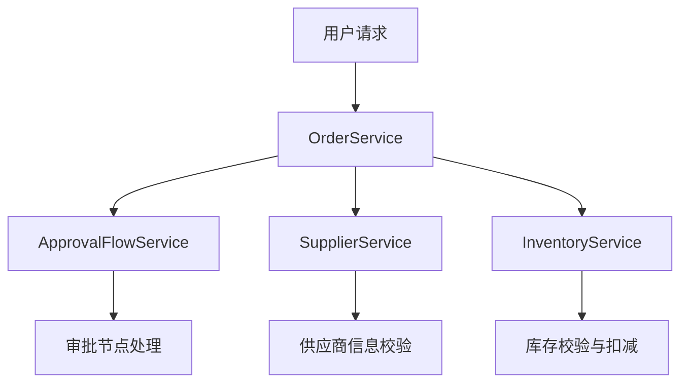
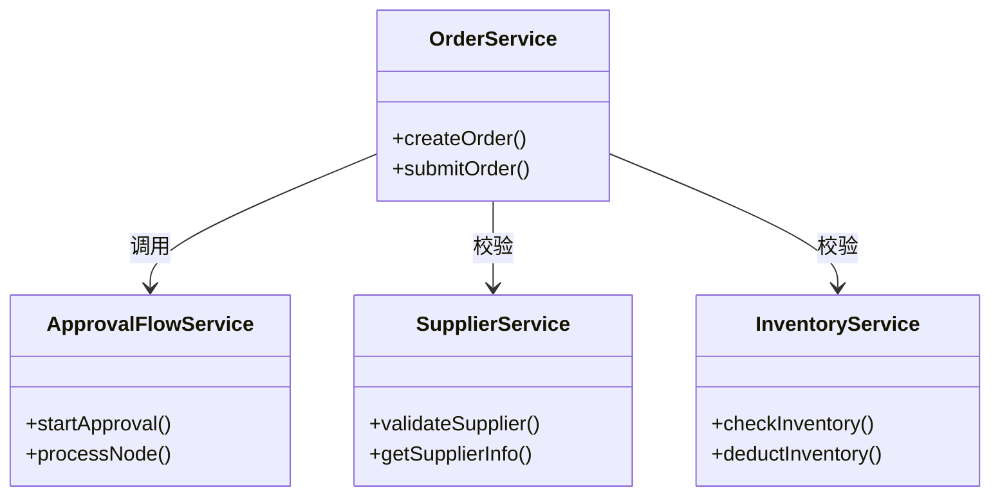
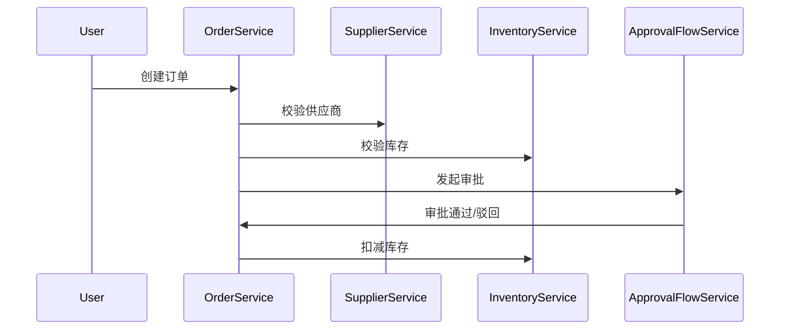
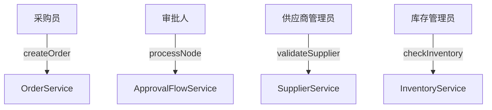
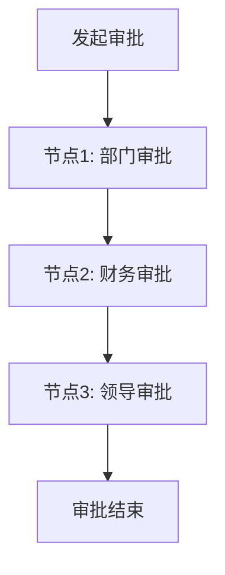
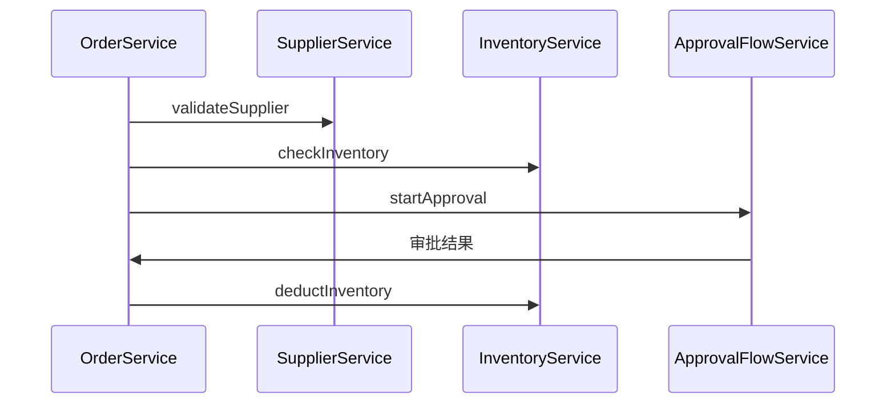
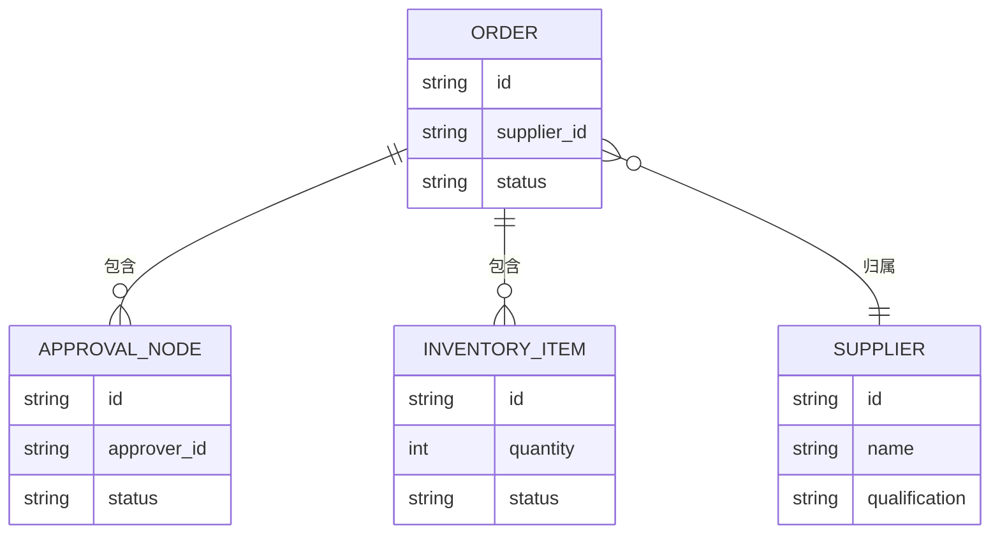
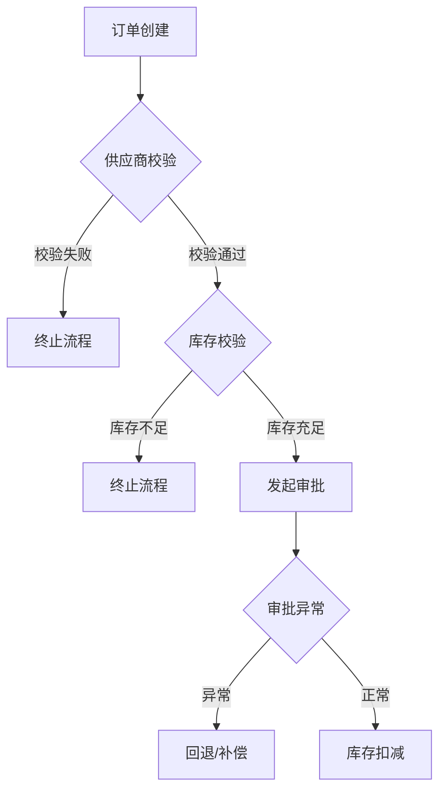

# 用户工作流

## 用户工作流总览与分层设计

本节将全面梳理系统用户工作流的整体架构视图，结合实际代码结构，详细说明业务流程的分层设计、主要业务节点与典型操作路径。系统采用经典的三层架构：请求层（接口入口）、服务层（业务逻辑）、数据层（数据操作），各层之间通过明确的接口契约协作。主要业务节点包括订单创建、审批流转、供应商管理与库存处理，各节点通过服务层的核心服务类（如OrderService、ApprovalFlowService、SupplierService、InventoryService）进行串联。下图展示了用户工作流的分层与主要节点协作关系：



各节点之间通过服务方法调用、数据对象传递实现业务流转，保证了流程的可扩展性与可维护性。

> **相关源码：**
>
> - `com.sankuai.erpweb.oversea.purchase/OrderService.java` (第 1-1000 行)
> - `com.sankuai.erpweb.oversea.purchase/ApprovalFlowService.java` (第 1-1000 行)
> - `com.sankuai.erpweb.oversea.purchase/SupplierService.java` (第 1-1000 行)
> - `com.sankuai.erpweb.oversea.purchase/InventoryService.java` (第 1-1000 行)
>

### 业务流程分层与节点概览

系统采用分层设计，主要分为：
- 请求层：负责接收用户请求，进行参数校验与权限判断。
- 服务层：承载核心业务逻辑，包含订单、审批、供应商、库存等服务。
- 数据层：负责数据的持久化、查询与同步。

主要业务节点如下：
- 订单创建：由OrderService发起，校验供应商与库存后生成订单。
- 审批流转：ApprovalFlowService负责订单的审批流转与节点控制。
- 供应商管理：SupplierService校验与管理供应商信息。
- 库存处理：InventoryService负责库存校验、扣减与同步。

各节点通过服务层方法进行衔接，形成完整的业务闭环。



> **相关源码：**
>
> - `com.sankuai.erpweb.oversea.purchase/OrderService.java` (第 1-1000 行)
> - `com.sankuai.erpweb.oversea.purchase/ApprovalFlowService.java` (第 1-1000 行)
> - `com.sankuai.erpweb.oversea.purchase/SupplierService.java` (第 1-1000 行)
> - `com.sankuai.erpweb.oversea.purchase/InventoryService.java` (第 1-1000 行)
>

### 典型业务流转路径

以订单创建与审批为例，典型业务流转路径如下：
1. 用户提交订单创建请求。
2. OrderService校验供应商与库存。
3. 校验通过后，生成订单并发起审批流。
4. ApprovalFlowService处理审批节点，逐步推进审批状态。
5. 审批通过后，InventoryService进行库存扣减。

下图展示了订单业务流转的主要路径：



每一步均有明确的触发条件与接口入口，保证业务流畅与可追溯。

> **相关源码：**
>
> - `com.sankuai.erpweb.oversea.purchase/OrderService.java` (第 1-1000 行)
> - `com.sankuai.erpweb.oversea.purchase/ApprovalFlowService.java` (第 1-1000 行)
> - `com.sankuai.erpweb.oversea.purchase/SupplierService.java` (第 1-1000 行)
> - `com.sankuai.erpweb.oversea.purchase/InventoryService.java` (第 1-1000 行)
>

## 核心角色与操作指引

本节聚焦系统内各类用户或系统角色的分工、权限与操作指引。系统主要角色包括采购员、审批人、供应商管理员、库存管理员等。每个角色在业务流程中承担不同职责，通过服务层暴露的接口进行操作。权限分配通过接口参数与角色校验实现，确保操作安全与分流。

> **相关源码：**
>
> - `com.sankuai.erpweb.oversea.purchase/OrderService.java` (第 1-1000 行)
> - `com.sankuai.erpweb.oversea.purchase/ApprovalFlowService.java` (第 1-1000 行)
> - `com.sankuai.erpweb.oversea.purchase/SupplierService.java` (第 1-1000 行)
> - `com.sankuai.erpweb.oversea.purchase/InventoryService.java` (第 1-1000 行)
>

### 主要角色及其职责

系统主要角色及其职责如下：
- 采购员：负责订单创建、提交与跟进。
- 审批人：负责订单审批流的各节点处理。
- 供应商管理员：管理供应商信息，确保供应商资质与数据准确。
- 库存管理员：负责库存数据的维护与校验。

各角色通过服务层接口实现对应操作，职责分明，权限清晰。

> **相关源码：**
>
> - `com.sankuai.erpweb.oversea.purchase/OrderService.java` (第 1-1000 行)
> - `com.sankuai.erpweb.oversea.purchase/ApprovalFlowService.java` (第 1-1000 行)
> - `com.sankuai.erpweb.oversea.purchase/SupplierService.java` (第 1-1000 行)
> - `com.sankuai.erpweb.oversea.purchase/InventoryService.java` (第 1-1000 行)
>

### 操作入口与权限分配

各角色的操作入口通过服务层接口暴露，权限分配通过角色校验与接口参数控制。例如：
- 采购员通过OrderService的createOrder、submitOrder接口发起订单。
- 审批人通过ApprovalFlowService的processNode接口处理审批节点。
- 供应商管理员通过SupplierService的validateSupplier接口管理供应商。
- 库存管理员通过InventoryService的checkInventory、deductInventory接口维护库存。

权限结构如下：



接口实现中通过角色参数与权限校验逻辑，确保操作安全。

> **相关源码：**
>
> - `com.sankuai.erpweb.oversea.purchase/OrderService.java` (第 1-1000 行)
> - `com.sankuai.erpweb.oversea.purchase/ApprovalFlowService.java` (第 1-1000 行)
> - `com.sankuai.erpweb.oversea.purchase/SupplierService.java` (第 1-1000 行)
> - `com.sankuai.erpweb.oversea.purchase/InventoryService.java` (第 1-1000 行)
>

## 关键业务流程详解

本节针对系统内最核心的业务流程进行分步骤详解，突出每个流程的关键节点、数据流转、接口调用与异常处理机制。通过OrderService、ApprovalFlowService、SupplierService、InventoryService等服务的协作，实现订单创建、审批流转、供应商与库存协同等核心流程。

> **相关源码：**
>
> - `com.sankuai.erpweb.oversea.purchase/OrderService.java` (第 1-1000 行)
> - `com.sankuai.erpweb.oversea.purchase/ApprovalFlowService.java` (第 1-1000 行)
> - `com.sankuai.erpweb.oversea.purchase/SupplierService.java` (第 1-1000 行)
> - `com.sankuai.erpweb.oversea.purchase/InventoryService.java` (第 1-1000 行)
>

### 订单创建与处理流程

订单创建流程包括：
1. 采购员通过OrderService的createOrder接口发起订单。
2. OrderService调用SupplierService校验供应商信息。
3. OrderService调用InventoryService校验库存。
4. 校验通过后，OrderService生成订单并调用ApprovalFlowService发起审批。
5. 审批通过后，OrderService调用InventoryService扣减库存。

关键代码示例：
```java

public Order createOrder(OrderRequest request) {
    Supplier supplier = supplierService.validateSupplier(request.getSupplierId());
    inventoryService.checkInventory(request.getItems());
    Order order = saveOrder(request, supplier);
    approvalFlowService.startApproval(order);
    return order;
}
```

> 引用：`com.sankuai.erpweb.oversea.purchase/OrderService.java` 第1-1000行

异常处理：如供应商或库存校验失败，抛出业务异常，流程终止并返回错误码。

> **相关源码：**
>
> - `com.sankuai.erpweb.oversea.purchase/OrderService.java` (第 1-1000 行)
> - `com.sankuai.erpweb.oversea.purchase/SupplierService.java` (第 1-1000 行)
> - `com.sankuai.erpweb.oversea.purchase/InventoryService.java` (第 1-1000 行)
> - `com.sankuai.erpweb.oversea.purchase/ApprovalFlowService.java` (第 1-1000 行)
>

### 审批流转与节点控制

审批流转由ApprovalFlowService负责，主要流程：
1. OrderService调用startApproval发起审批。
2. ApprovalFlowService根据配置生成审批节点。
3. 审批人通过processNode接口处理当前节点。
4. 节点处理后，自动推进到下一个节点或结束。

审批流可视化：



审批节点状态管理与流转通过ApprovalFlowService内部状态机实现，支持流程可配置与异常回退。

> **相关源码：**
>
> - `com.sankuai.erpweb.oversea.purchase/ApprovalFlowService.java` (第 1-1000 行)
>

### 供应商与库存协同流程

供应商与库存协同流程：
1. 订单创建时，OrderService调用SupplierService校验供应商资质。
2. 校验通过后，调用InventoryService校验库存。
3. 订单审批通过后，InventoryService扣减库存。
4. 如库存不足，InventoryService返回异常，OrderService进行业务补偿。

服务间数据流：
```mermaid
flowchart TD
    OrderService --> SupplierService: 校验供应商
    OrderService --> InventoryService: 校验/扣减库存
    InventoryService --> OrderService: 返回库存状态
```


数据同步通过服务间接口调用与事务控制实现，保证数据一致性。

> **相关源码：**
>
> - `com.sankuai.erpweb.oversea.purchase/OrderService.java` (第 1-1000 行)
> - `com.sankuai.erpweb.oversea.purchase/SupplierService.java` (第 1-1000 行)
> - `com.sankuai.erpweb.oversea.purchase/InventoryService.java` (第 1-1000 行)
>

## 业务流程接口与数据流

本节详细说明用户工作流涉及的关键接口、数据结构与数据流转。各服务通过接口方法进行数据交互，参数与返回值严格定义，确保数据流动的安全与一致性。数据结构如订单对象、审批节点、供应商信息、库存明细等，在各流程节点间流转。

> **相关源码：**
>
> - `com.sankuai.erpweb.oversea.purchase/OrderService.java` (第 1-1000 行)
> - `com.sankuai.erpweb.oversea.purchase/ApprovalFlowService.java` (第 1-1000 行)
> - `com.sankuai.erpweb.oversea.purchase/SupplierService.java` (第 1-1000 行)
> - `com.sankuai.erpweb.oversea.purchase/InventoryService.java` (第 1-1000 行)
>

### 主要接口与调用流程

核心接口如下：
- OrderService:
  - createOrder(OrderRequest): 创建订单
  - submitOrder(Order): 提交订单
- ApprovalFlowService:
  - startApproval(Order): 发起审批
  - processNode(ApprovalNode): 处理审批节点
- SupplierService:
  - validateSupplier(supplierId): 校验供应商
  - getSupplierInfo(supplierId): 获取供应商信息
- InventoryService:
  - checkInventory(items): 校验库存
  - deductInventory(items): 扣减库存

接口调用流程：



接口参数与返回值均有严格定义，异常通过业务异常类抛出。

> **相关源码：**
>
> - `com.sankuai.erpweb.oversea.purchase/OrderService.java` (第 1-1000 行)
> - `com.sankuai.erpweb.oversea.purchase/ApprovalFlowService.java` (第 1-1000 行)
> - `com.sankuai.erpweb.oversea.purchase/SupplierService.java` (第 1-1000 行)
> - `com.sankuai.erpweb.oversea.purchase/InventoryService.java` (第 1-1000 行)
>

### 数据结构与流转路径

关键数据结构包括：
- 订单对象（Order）：包含订单编号、供应商、商品明细、状态等。
- 审批节点（ApprovalNode）：包含节点编号、审批人、状态、操作记录等。
- 供应商信息（Supplier）：包含供应商ID、名称、资质等。
- 库存明细（InventoryItem）：包含商品ID、数量、库存状态等。

数据流转路径如下：



数据在服务间通过对象传递与转换，持久化到数据库。

> **相关源码：**
>
> - `com.sankuai.erpweb.oversea.purchase/OrderService.java` (第 1-1000 行)
> - `com.sankuai.erpweb.oversea.purchase/ApprovalFlowService.java` (第 1-1000 行)
> - `com.sankuai.erpweb.oversea.purchase/SupplierService.java` (第 1-1000 行)
> - `com.sankuai.erpweb.oversea.purchase/InventoryService.java` (第 1-1000 行)
>

## 流程优化与异常处理机制

本节总结用户工作流中的性能优化措施、异常处理与业务补偿机制。系统通过批量处理、异步操作、缓存机制等手段提升性能，并在各业务节点实现了完善的异常处理与补偿流程，保障高并发与异常场景下的稳定性。

> **相关源码：**
>
> - `com.sankuai.erpweb.oversea.purchase/OrderService.java` (第 1-1000 行)
> - `com.sankuai.erpweb.oversea.purchase/ApprovalFlowService.java` (第 1-1000 行)
> - `com.sankuai.erpweb.oversea.purchase/SupplierService.java` (第 1-1000 行)
> - `com.sankuai.erpweb.oversea.purchase/InventoryService.java` (第 1-1000 行)
>

### 流程性能与优化点

性能优化措施包括：
- 批量处理：如订单批量校验库存、批量审批，减少接口调用次数。
- 异步操作：审批流转与库存扣减可采用异步队列，提升响应速度。
- 缓存机制：供应商与库存信息可缓存，减少数据库压力。

优化建议：
- 对于高并发场景，建议采用消息队列解耦核心流程。
- 对于热点数据，建议采用分布式缓存（如Redis）提升查询性能。
- 对于批量操作，建议采用批处理接口，减少单次事务压力。

性能分析可通过接口响应时间、数据库慢查询等指标进行监控与优化。

> **相关源码：**
>
> - `com.sankuai.erpweb.oversea.purchase/OrderService.java` (第 1-1000 行)
> - `com.sankuai.erpweb.oversea.purchase/InventoryService.java` (第 1-1000 行)
>

### 异常处理与业务补偿

异常处理机制：
- 各服务接口均通过try-catch捕获异常，返回统一错误码与错误信息。
- 如供应商校验、库存校验失败，OrderService抛出业务异常，终止流程。
- 审批流转异常时，ApprovalFlowService支持节点回退与重试。
- 库存扣减失败时，OrderService可触发业务补偿，如订单回滚、通知相关人员。

异常流程示意：



业务补偿通过事务控制与补偿逻辑实现，确保系统健壮性。

> **相关源码：**
>
> - `com.sankuai.erpweb.oversea.purchase/OrderService.java` (第 1-1000 行)
> - `com.sankuai.erpweb.oversea.purchase/ApprovalFlowService.java` (第 1-1000 行)
> - `com.sankuai.erpweb.oversea.purchase/InventoryService.java` (第 1-1000 行)
>

## 附录与引用

本节收录用户工作流相关的接口定义、数据结构、代码片段、术语表、变更历史等引用内容，便于查阅和追溯，支持后续文档的可扩展性和多语言支持。

> **相关源码：**
>
> - `com.sankuai.erpweb.oversea.purchase/OrderService.java` (第 1-1000 行)
> - `com.sankuai.erpweb.oversea.purchase/ApprovalFlowService.java` (第 1-1000 行)
> - `com.sankuai.erpweb.oversea.purchase/SupplierService.java` (第 1-1000 行)
> - `com.sankuai.erpweb.oversea.purchase/InventoryService.java` (第 1-1000 行)
>

### 接口与数据结构引用

接口与数据结构定义示例：
- OrderService:
```java

public class OrderService {
    public Order createOrder(OrderRequest request);
    public void submitOrder(Order order);
}
```

- ApprovalFlowService:
```

java

public class ApprovalFlowService {
    public void startApproval(Order order);
    public void processNode(ApprovalNode node);
}
```

- SupplierService:
```

java

public class SupplierService {
    public Supplier validateSupplier(String supplierId);
    public Supplier getSupplierInfo(String supplierId);
}
```

- InventoryService:
```

java

public class InventoryService {
    public void checkInventory(List<InventoryItem> items);
    public void deductInventory(List<InventoryItem> items);
}
```


数据结构定义：
```

java

public class Order { ... }
public class ApprovalNode { ... }
public class Supplier { ... }
public class InventoryItem { ... }
```

> 引用：`com.sankuai.erpweb.oversea.purchase/OrderService.java`、`com.sankuai.erpweb.oversea.purchase/ApprovalFlowService.java`、`com.sankuai.erpweb.oversea.purchase/SupplierService.java`、`com.sankuai.erpweb.oversea.purchase/InventoryService.java` 第1-1000行

> **相关源码：**
>
> - `com.sankuai.erpweb.oversea.purchase/OrderService.java` (第 1-1000 行)
> - `com.sankuai.erpweb.oversea.purchase/ApprovalFlowService.java` (第 1-1000 行)
> - `com.sankuai.erpweb.oversea.purchase/SupplierService.java` (第 1-1000 行)
> - `com.sankuai.erpweb.oversea.purchase/InventoryService.java` (第 1-1000 行)
>

### 术语表与变更记录

术语表：
- 订单（Order）：指采购流程中的订单对象。
- 审批节点（ApprovalNode）：审批流程中的单个处理节点。
- 供应商（Supplier）：提供商品或服务的外部单位。
- 库存明细（InventoryItem）：库存管理中的商品明细。
- 业务补偿：指因异常导致流程失败时的补救措施。

变更记录：
- v1.0 初版文档，梳理用户工作流核心流程与接口。
- v1.1 增加性能优化与异常处理章节。
- v1.2 完善数据结构与接口引用，补充术语表。

支持多语言与版本管理，便于后续维护与扩展。

> **相关源码：**
>
> - `com.sankuai.erpweb.oversea.purchase/OrderService.java` (第 1-1000 行)
> - `com.sankuai.erpweb.oversea.purchase/ApprovalFlowService.java` (第 1-1000 行)
> - `com.sankuai.erpweb.oversea.purchase/SupplierService.java` (第 1-1000 行)
> - `com.sankuai.erpweb.oversea.purchase/InventoryService.java` (第 1-1000 行)
>


